| Page Type | Languages        | Key Services                                                                                     | Tools                                         |
| --------- | ---------------- | ------------------------------------------------------------------------------------------------ | --------------------------------------------- |
| Sample    | C# (.NET Core 6) | Azure Functions <br> Azure User-Assigned Managed Identity <br> Azure DevOps <br> Azure Pipelines | Visual Studio <br> Azure Functions Core Tools |

---

# Making Authenticated Requests to the Azure DevOps REST API with Managed Identity

When calling the [Azure DevOps REST API](https://learn.microsoft.com/en-us/rest/api/azure/devops/?view=azure-devops-rest-7.2), a common approach is to generate a [Personal Access Token (PAT)](https://learn.microsoft.com/en-us/azure/devops/organizations/accounts/use-personal-access-tokens-to-authenticate?view=azure-devops&tabs=Windows) to authenticate requests, but managing PATs can expose you to security risks if not properly handled. This codebase demonstrates how to avoid managing PATs and Secrets entirely by providing an example of [making authenticated requests to the Azure DevOps REST API with a Managed Identity](https://learn.microsoft.com/en-us/azure/devops/integrate/get-started/authentication/service-principal-managed-identity?view=azure-devops) via an [Azure Function](https://learn.microsoft.com/en-us/azure/azure-functions/functions-overview?pivots=programming-language-csharp).

This codebase provides a modified and more detailed walkthrough of [this sample GitHub project](https://github.com/microsoft/azure-devops-auth-samples/tree/master/ServicePrincipalsSamples/ClientLibsNET/3-AzureFunction-ManagedIdentity) and [this video guide](https://www.microsoft.com/en-us/videoplayer/embed/RWWL8L?postJsllMsg=true). The Function in this guide runs an Azure Pipeline when a request is made.

The scenario presented in this codebase is simple and contrived, and it should be viewed as a foundation for modification and expansion into more complex applications.

## Prerequisites

- [An Azure Subscription](https://azure.microsoft.com/en-us/free/) - for hosting cloud infrastructure
- [Azure DevOps](https://azure.microsoft.com/en-us/products/devops/) with an [Organization](https://learn.microsoft.com/en-us/azure/devops/organizations/accounts/create-organization?view=azure-devops), [Project](https://learn.microsoft.com/en-us/azure/devops/organizations/projects/create-project?view=azure-devops&tabs=browser) and a [Pipeline](https://learn.microsoft.com/en-us/azure/devops/pipelines/create-first-pipeline?view=azure-devops&tabs=java%2Ctfs-2018-2%2Cbrowser)

- [Visual Studio](https://visualstudio.microsoft.com/) - for development and publishing to Azure
- [Azure Functions Core Tools](https://learn.microsoft.com/en-us/azure/azure-functions/functions-core-tools-reference?tabs=v2) - for local Function development

## Running the sample

1. [Create a new .NET 6.0 Function project in Visual Studio](https://learn.microsoft.com/en-us/azure/azure-functions/functions-create-your-first-function-visual-studio).

2. Add the code from `AzDOFunction/AzDOFunction/Function1.cs` to the `.cs` file in your project.

3. Open the Terminal in Visual Studio (View > Terminal), `cd` to your project directory, and run the following commands to install the required project dependencies (package versions current as of writing):

   ```
   dotnet add package Microsoft.VisualStudio.Services.InteractiveClient --version 19.232.0-preview

   dotnet add package Microsoft.TeamFoundationServer.Client --version 19.232.0-preview

   dotnet add package Azure.Identity --version 1.10.4

   dotnet add package Microsoft.NET.Sdk.Functions --version 4.2.0
   ```

4. Ensure you're [signed into Visual Studio](https://learn.microsoft.com/en-us/visualstudio/subscriptions/sign-in-work) with an account that has access to your Azure Tenant.

5. In Azure, [create a user-assigned Managed Identity](https://learn.microsoft.com/en-us/entra/identity/managed-identities-azure-resources/how-manage-user-assigned-managed-identities?pivots=identity-mi-methods-azp#create-a-user-assigned-managed-identity). It will be assigned to your Function later.

   - Consider creating a resource group for the Managed Identity, which you can later publish the Function to.

6. In Azure DevOps, [add the user-assigned Managed Identity to the AzDO Organization as a user](https://learn.microsoft.com/en-us/azure/devops/organizations/accounts/add-organization-users?view=azure-devops&tabs=browser#add-users-to-your-organization) with the appropriate permissions. When searching for a user, type in the name of the user-assigned Managed Identity that you created.

   - 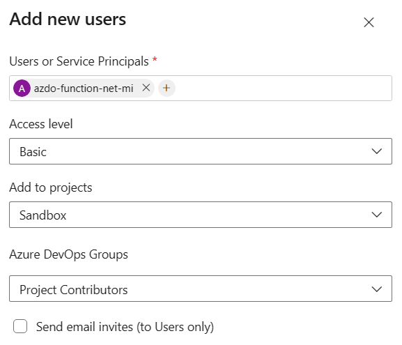

7. In Visual Studio in your `.cs` file, update the following string variables in the declarations section of the class:

   - `AdoOrgName`: This is the name of your Azure DevOps Organization
   - `AadTenantId`: You can get this [from the Azure Portal](https://learn.microsoft.com/en-us/azure/azure-portal/get-subscription-tenant-id)
   - `AadUserAssignedManagedIdentityClientId`: This is the Client ID of the user-assigned Managed Identity you created. You can get this [from the Azure Portal](https://learn.microsoft.com/en-us/entra/identity/managed-identities-azure-resources/how-manage-user-assigned-managed-identities?pivots=identity-mi-methods-azp#list-user-assigned-managed-identities)

8. [Test your Function app locally](https://learn.microsoft.com/en-us/azure/azure-functions/functions-create-your-first-function-visual-studio#run-the-function-locally). Consider invoking the local Function from a tool like Postman.

   - When calling the Function, two querysting parameters are required:

     - `projectName`: Name of the Azure DevOps Project
     - `pipelineId`: ID of the Pipeline you want to run. You can get the Pipeline ID from the URL of the Pipeline in Azure DevOps.
     - The URL may look like: `http://localhost:<port>/api/<function-name>?pipelineId=<id>&projectName=<name>`
     - On success, you will see the message, "Pipeline run started". If you navigate to the Pipeline in Azure DevOps, you will see a new run.

9. [Publish the Function to Azure](https://learn.microsoft.com/en-us/azure/azure-functions/functions-create-your-first-function-visual-studio#publish-the-project-to-azure).

   - In addition to the Function resource in Azure, this deployment requires a Resource Group, Storage Account, and optionally an App Insights resource. If you don't already have these resources created, you can create them at this point.
   - Consider publishing to a Windows plan, which provides a better testing experience in the Azure Portal. Using App Insights is also highly recommended to enable a better debugging experience.

   1. 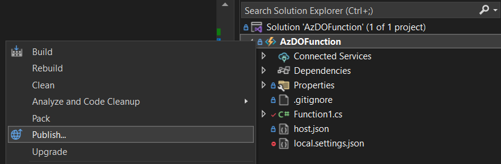
   2. 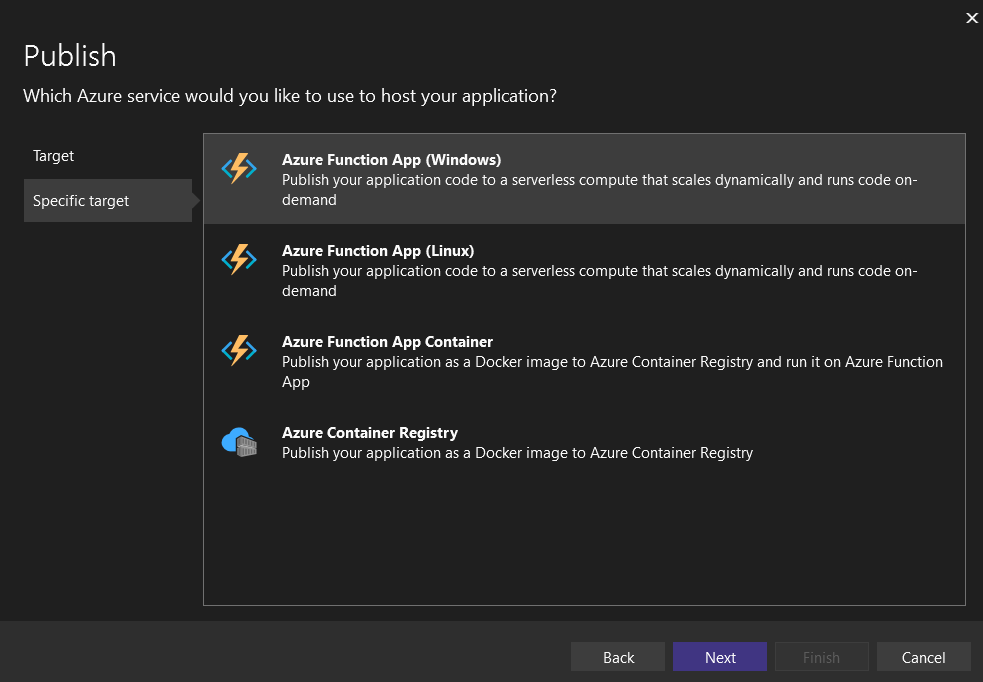
   3. 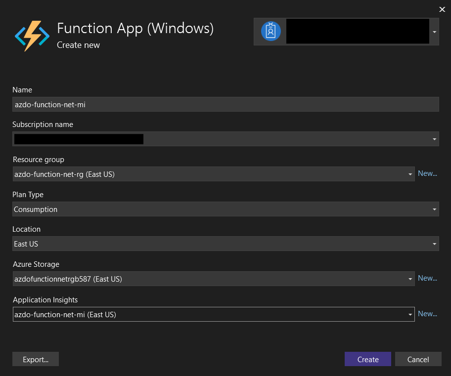
   4. 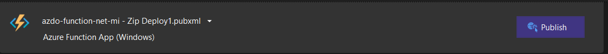

10. In your Azure Function, navigate to the Identity blade and assign the user-assigned Managed Identity to the Function.

    - 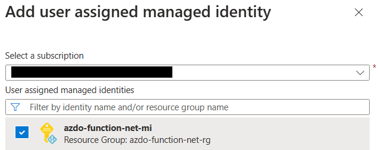

11. Test your Azure Function. You can use the [Code + Test feature](https://learn.microsoft.com/en-us/azure/azure-functions/functions-create-function-app-portal#test-the-function) in the Azure Portal editor - you may need to enable CORS for https://portal.azure.com in the Function's CORS settings. Remember to include the two required querystring parameters.

    1. 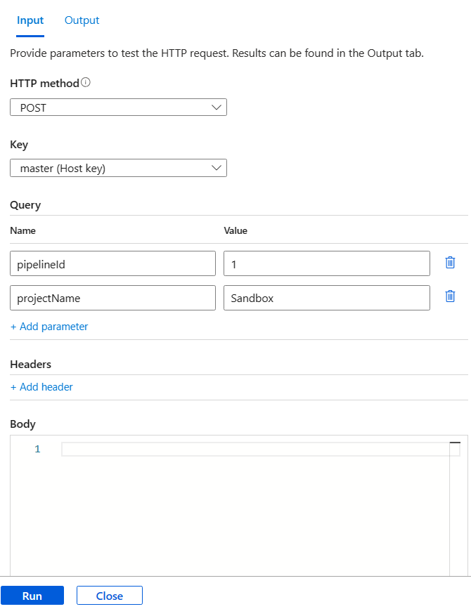
    2. 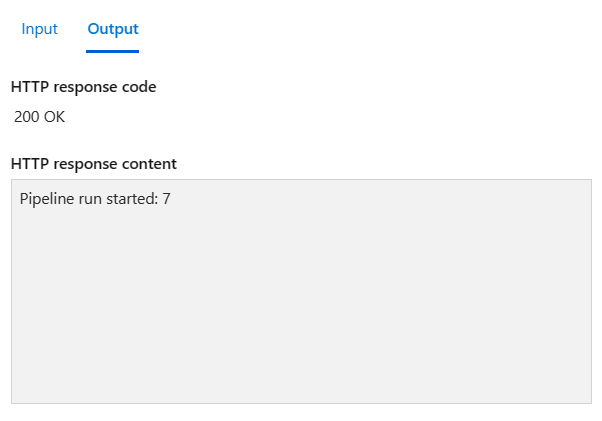

    - On success, you will see the message, "Pipeline run started". If you navigate to the Pipeline in Azure DevOps, you will see a new run.

12. You may now POST to the Function app URL from any other service to initiate pipeline runs without needing to manage PATs or Secrets.

## Setting Variables at Queue Time

If you want to be able to set variables, create a pipeline variable in Azure DevOps and select 'Settable at queue time' on the variables tab of the pipeline editor. Read more at [https://aka.ms/AzPipelines/SettingVariablesAtQueueTime](https://aka.ms/AzPipelines/SettingVariablesAtQueueTime).

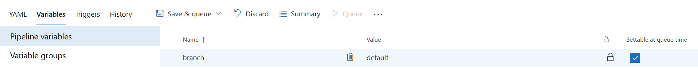

Ensure you also update the variable and set 'Let users override this value when running this pipeline'.

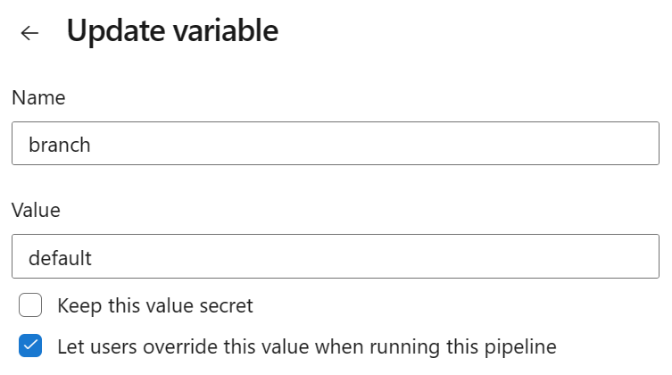

In your pipeline, you can now reference the variable as `$(variableName)` (in the example, this would be `$(branch)`).

To pass your variable to the pipeline when calling the Function, add a JSON object to the body, where the key matches the variable name and the value is the value you want to set. In your `.cs` file, update the `JsonKey` variable to the name of the key you want to use. For example, in the provided code, the key is `branch`, so the JSON object passed into the REST API body would look like:

```json
{
  "branch": "your-branch-name"
}
```

Note that in this example, I hardcoded the JsonKey, but you can modify the code to more dynamically set the key.

If you do not want to use variables, you can comment out the block of code between the comments 'the below/above code is used to set a pipeline variable'.

This example sets a single variable, but you can modify the code to set multiple variables.

## Architecture

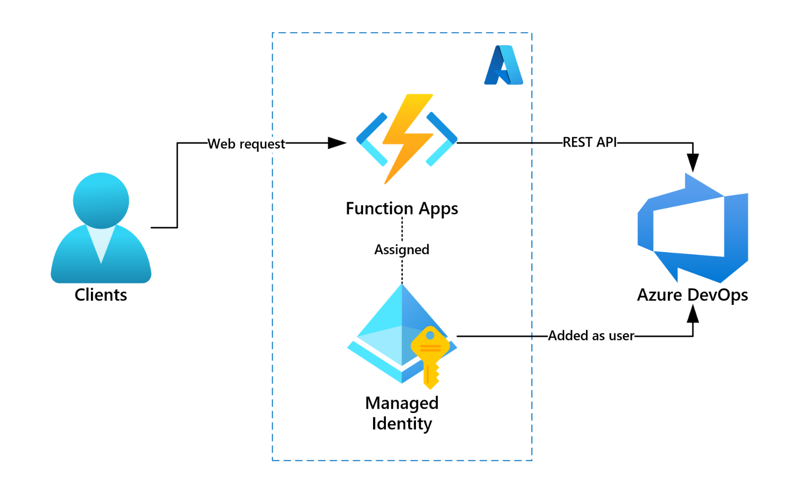

## Optional enhancements

- Optionally consider configuring the Azure DevOps organization name, Tenant ID, and Managed Identity Client ID as settings in `local.settings.json` and in the Azure Function App configuration. In this sample, the settings are hardcoded in the code for simplicity.
- Consider using Infrastructure as Code to create the Function App and assign the user-assigned Managed Identity to it.
- Consider building a CI/CD pipeline for deploying the Function App.

## Additional Resources

- [Introducing Service Principal and Managed Identity support on Azure DevOps](https://devblogs.microsoft.com/devops/introducing-service-principal-and-managed-identity-support-on-azure-devops/)
- [Azure DevOps Services: Authenticate with service principals or managed identities](https://learn.microsoft.com/en-us/azure/devops/integrate/get-started/authentication/service-principal-managed-identity?view=azure-devops)
- [How to Invoke Azure DevOps REST API using System Managed Identity - _blog_](https://medium.com/@relente/using-system-managed-identity-to-invoke-azure-devops-rest-api-7833bc988705)
